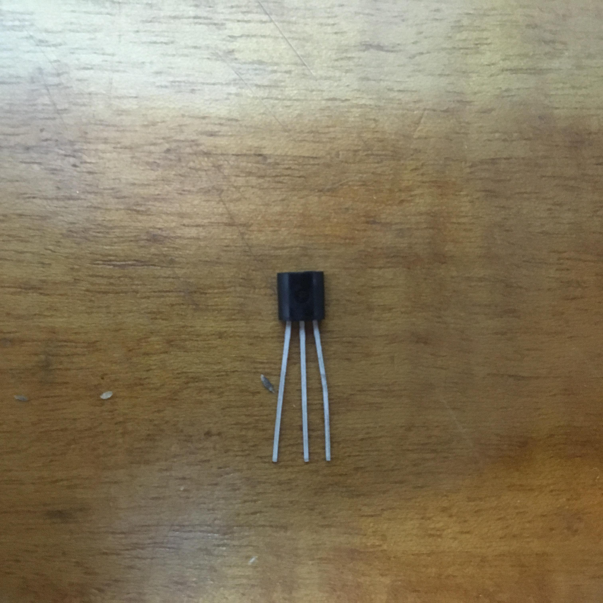
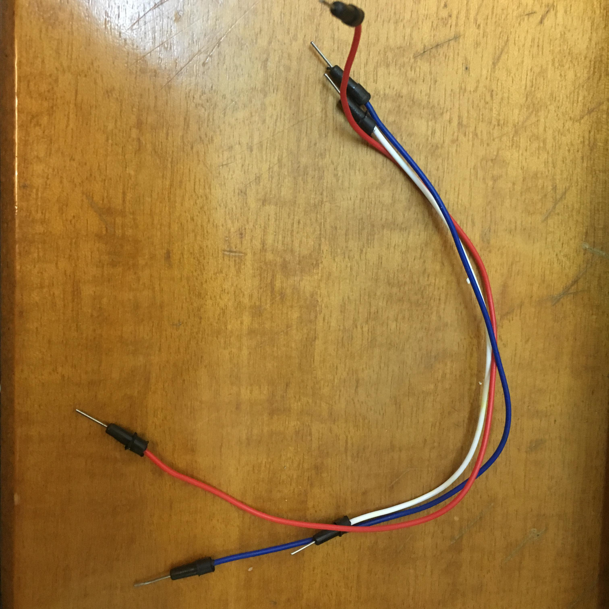
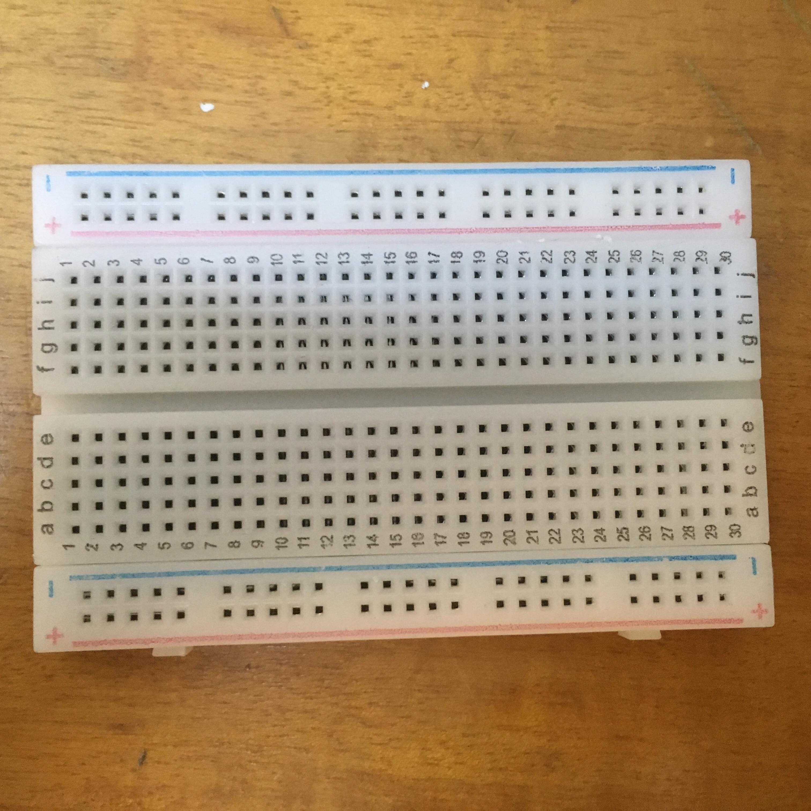

# Temperature-Sensor
**Measuring temperature using the  TMP36 temperature sensor and an arduino uno**

## WHAT YOU NEED
**Arduino Uno**

 

**TMP36 Temperature sensor**

 

**Wires**

 

**Breadboard**

 

